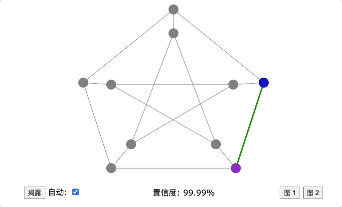
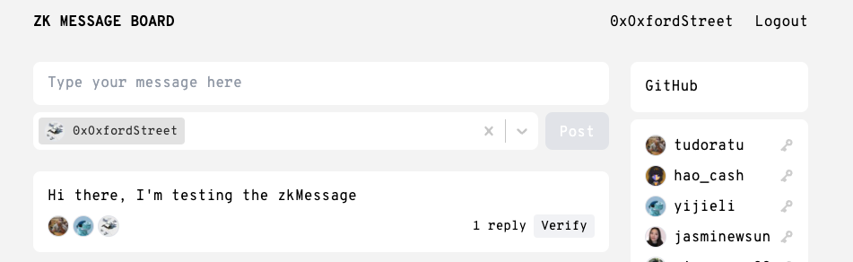

# 第1课 课后作业

## ZKP 三色演示-页面底部的练习 1。

访问并试用[交互式演示](https://zkshanghai.xyz/interactive/graph.html)。

我们来分析一波，针对三色问题的零知识证明是什么：让验证者相信一个事实——一个图仅有三个颜色。至于确切的涂色方案等等其他一切信息对于验证者都是保密的。

我作为验证者verifier，当我只能选择相邻的边进行验证的时，证明者（也就是程序本身）向我展示相邻节点的颜色。即使是同一对相邻节点，每次点击验证过后其着色方案也不尽相同。放眼全图无论任意两个相邻节点的着色方案如何变化，始终都没有出现第三个颜色。事实得证。

再考虑泄密的问题，如果证明者着色方案始终保持不变而不是在每次验证之前都针对图中所有同色节点发生一次全体变换，那么遍历验证不同相邻节点并标注颜色就可以得出确切的涂色方案。前者会泄露涂色方案，不是零知识的，而后者是反逆向工程的完成了是零知识的。

总上，判断一个证明是否是零知识证明，从两个角度考虑：

1. 对于一个事实，验证者V能够从证明者P给出的response验证其符合这个事实。——证明
2. 证明者P给出的response不能直接或者间接的透露出除了反映1中的事实之外的任何信息。——零知识

回到本题，如果验证者V可以选择任意节点对来检查，证明仍然是零知识吗？

答：证明不是零知识的：

1. 验证者V能够从证明者P给出的response验证这个图仅有三个颜色的事实；
2. 验证者每次都固定选一个节点A和其他任意一个节点，尽管每次A的颜色都会变化，但是那些和A同色的节点也会对应变化，这样我们知道至少一个除了1以外的事实：A的若干同色节点的位置。——不满足零知识。

对于2，给出的新验证方式能不能、能得出什么“额外事实"，确实不好想，可以试试极限思维；也可以试试从证明者想要保守什么信息的角度思考（或许？）。还有，一次选择任意两个节点是对一次只能选择相邻节点这种方式的扩展，条件放宽确实有泄漏秘密的风险。

最后发散点思维，验证者验证的无限快，证明者证明的无限快，最终每个节点显示在屏幕上的应该是三种颜色叠加色吧/。那么在不同验证频率下保证以上两种不同的验证方式验证频率同频，加以人眼的视觉暂留的辅助，两种方式在相同验证频率下呈现的图景会一样吗？

## zkmessage.xyz

在 [zkmessage](https://zkmessage.xyz/) 上创建一个帐户并发布消息，这是一个由 zkSNARK 支持的匿名留言板。

1. 解释为什么你需要生成并保存一个“秘密值” 。

   在 zkmessage 上创建帐户和发布消息都需要使用 zkSNARK 技术的证明。这意味着每个用户必须为其身份生成一个秘密值，以便计算证明时验证其身份而不暴露真实身份。
2. 用白话写出 ZK 中正在证明的陈述。

   zkSNARK（零知识可扩展非交互式论证）是一种强大的加密学技术，允许证明某人已经满足某些条件，而无需泄露更多信息，比如他们的真实身份或数据。在 zkmessage 中，ZK 正在证明提交消息的用户拥有一个有效的身份，并且有权访问此特定消息板。
3. 从不同的浏览器或计算机登录到相同的 zkmessage 帐户。 解释为什么 zkmessage 不能像大多数社交应用程序一样，只使用简单的“用户名/密码” 。

   如果 zkmessage 只使用简单的“用户名/密码”，那么它本质上是中心化的，并且需要存储敏感的用户帐户信息。这样做将使得用户隐私受到威胁，因为与大多数社交应用程序不同，zkmessage 的目标是提供完全匿名的服务。这就是为什么 zkmessage 使用 zkSNARK 技术来保护用户的身份和隐私，而不收集任何敏感信息。

如果您好奇，我们在[此处](https://0xparc.org/blog/zk-group-sigs)更深入地探讨了 zkmessage 的构建。
